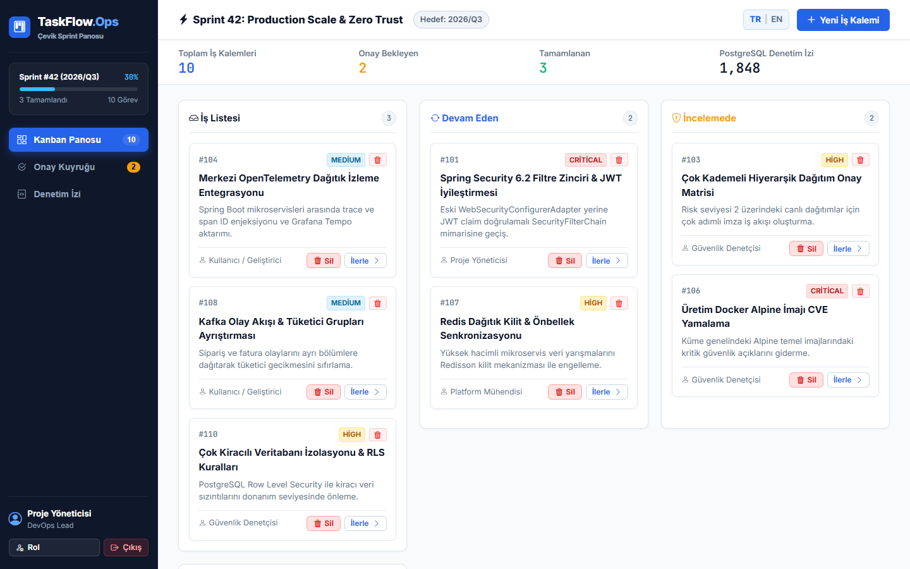
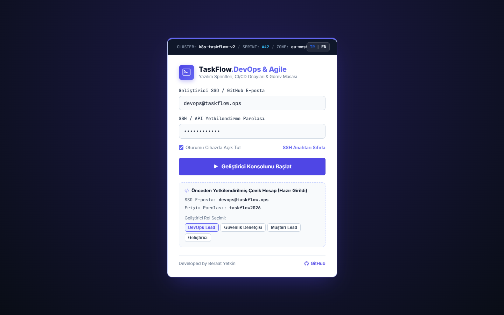

# TaskFlow.Ops ⚡
> **Agile & DevOps Görev Masası • Linear & Jira Tarzı Modern Sprint Panosu**

[](https://taskflowops.web.app)
[](LICENSE)
[](https://developer.mozilla.org)
[](https://developer.mozilla.org)
[](https://taskflowops.web.app)

---

## 📸 Canlı Önizleme (Previews)

### 1. Agile & DevOps Sprint Çalışma Masası
Linear ve Jira mimarisinden ilham alan 4 kolonlu Kanban panosu, sprint tamamlama yüzdesi ve her kart üzerinde **belirgin kırmızı görev silme butonları**:


### 2. Geliştirici Komuta Merkezi Giriş Portalı (Developer Command Deck)
Kubernetes küme telemetri şeridi, siber nokta ızgarası, SSH / API yetkilendirme alanları ve önceden tanımlı hazır roller:


---

## 🌟 Öne Çıkan Özellikler

### 1. Sektöre Özgü Agile & DevOps Mimarisi
- **Linear / Jira Tarzı Modern Tasarım**: Koyu lacivert/indigo arka plan, sol sabit hızlı erişim dock'u (`.agile-dock`) ve Sprint #42 ilerleme kartı.
- **4 Kolonlu Kanban İş Akışı**: *İş Listesi (Backlog)*, *Devam Eden (In Progress)*, *İncelemede (Review)* ve *Tamamlanan (Done)* sütunları arasında kart geçişleri.
- **Canlı DevOps Denetim İzi (Audit Log)**: PostgreSQL audit log simülasyonu ile her görev oluşturma, durum değiştirme ve silme işlemi `k8s-taskflow-v2` telemetrisiyle anlık olarak kaydedilir.

### 2. Belirgin Görev Silme (Task Deletion) Mekanizması
- **Kart Altında Kırmızı Sil Butonu**: Her Kanban kartının alt aksiyon barında durum ilerletme butonunun yanında doğrudan fark edilebilir kırmızı etiketli **"Sil" (`bi-trash3`)** butonu yer alır.
- **Başlık Çöp Kutusu İkonu**: Kart ID kodunun yanındaki silme ikonu kırmızı hover efektiyle güçlendirilmiştir.
- **Sprint Onay Kuyruğu Silme Aksiyonu**: Onay bekleyen görevler tablosunda doğrudan silme işlemi yapılabilir.
- **Dinamik Yeniden Hesaplama**: Bir görev silindiğinde `#deleteTaskModal` onay penceresi açılır; onaylandığında kart DOM'dan kaldırılır, `localStorage` (`tf_tasks_v2`) senkronize edilir, sprint doluluk yüzdesi ve tamamlanan iş sayaçları dinamik olarak yeniden hesaplanır.

### 3. Oturum Kalıcılığı (Session Persistence) & Zero-Flicker Başlangıç
- **Sayfa Yenilemelerinde Oturumu Hatırla**: `submitLogin()` sonrasında oturum durumu `localStorage.getItem('tf_logged_in')` ile saklanır.
- **Sıfır Titreme (Zero-Flicker)**: Sayfa yenilendiğinde (F5) inline script kontrolü sayesinde giriş ekranı 1 salise dahi görünmeden doğrudan çalışma masası açılır.
- **Güvenli Çıkış**: Sağ üstteki kırmızı **"Çıkış"** butonuna basıldığında oturum sıfırlanır ve giriş portalına güvenle dönülür.
- **Önceden Doldurulmuş Demo Bilgileri**: Giriş ekranında e-posta ve şifre hazır girili gelir; altındaki hızlı rol butonlarıyla (`DevOps Lead`, `Güvenlik Denetçisi`, `Müşteri Lead`, `Geliştirici`) tek tıkla kimlik değiştirilebilir.

### 4. Çift Dilli Tam Destek (TR | EN)
- Sağ üstteki dil seçici (`[ TR | EN ]`) ile sayfa yenilenmeden tüm Kanban başlıkları, modal metinleri, toast bildirimleri ve hata mesajları dinamik olarak güncellenir.
- Başlangıç varsayılan dili **Türkçe**'dir.

---

## 🛠️ Teknoloji Yığını (Tech Stack)

| Bileşen | Teknoloji / Kütüphane | Açıklama |
| :--- | :--- | :--- |
| **Arayüz (UI)** | HTML5, CSS3, Flexbox & CSS Grid | Sıfır harici CSS framework'ü, tam responsive mobil uyumlu |
| **Mantık & State** | Vanilla ES6+ JavaScript | Harici framework bağımlılığı olmaksızın tam reaktif state yönetimi |
| **İkon Seti** | Bootstrap Icons v1.11.3 | SVG tabanlı modern sistem ikonları |
| **Kalıcılık (Storage)** | HTML5 Web Storage (`localStorage`) | Görevler, denetim logları, oturum ve dil tercihleri |
| **Yayın Altyapısı** | Firebase Hosting (eticaretdepo) | Global CDN üzerinden SSL korumalı yüksek hızlı statik yayın |

---

## 📁 Proje Dizin Yapısı

```
TaskFlow/
├── index.html              # Tüm uygulama tek ve optimize edilmiş kaynak kodda
├── docs/                   # Dokümantasyon ve ekran görüntüleri
│   ├── preview-dashboard.png # Kanban panosu yüksek çözünürlüklü önizleme
│   └── preview-login.png     # Command Deck giriş ekranı önizleme
└── README.md               # Proje dokümantasyonu
```

---

## ⚡ Hızlı Başlangıç (Local Setup)

Projeyi yerel ortamınızda çalıştırmak için herhangi bir paket yöneticisi (`npm`, `yarn`) veya derleyici (`webpack`, `vite`) kurmanıza gerek yoktur:

1. Depoyu klonlayın:
   ```bash
   git clone https://github.com/kubrvk/TaskFlow.git
   cd TaskFlow
   ```
2. `index.html` dosyasını tarayıcınızda çift tıklayarak doğrudan açın:
   ```bash
   start index.html
   ```
3. Veya yerel bir HTTP sunucusu ile başlatın:
   ```bash
   npx serve .
   # veya
   python -m http.server 8080
   ```
4. Tarayıcınızda `http://localhost:8080` adresine gidin.
   - *Giriş ekranını atlayıp doğrudan panoyu görmek için:* `http://localhost:8080/?demo=1`

---

## 🌐 Canlı Sistem

- **Canlı URL**: [https://taskflowops.web.app](https://taskflowops.web.app)
- **Doğrudan Demo Bağlantısı**: [https://taskflowops.web.app/?demo=1](https://taskflowops.web.app/?demo=1)

---

## 👤 Geliştirici

**Developed by Beraat Yetkin**
- GitHub: [@kubrvk](https://github.com/kubrvk)
- Proje Deposu: [TaskFlow](https://github.com/kubrvk/TaskFlow)
- Portfolyo: [Beraat Yetkin Portfolio](https://github.com/kubrvk/portfolio)
